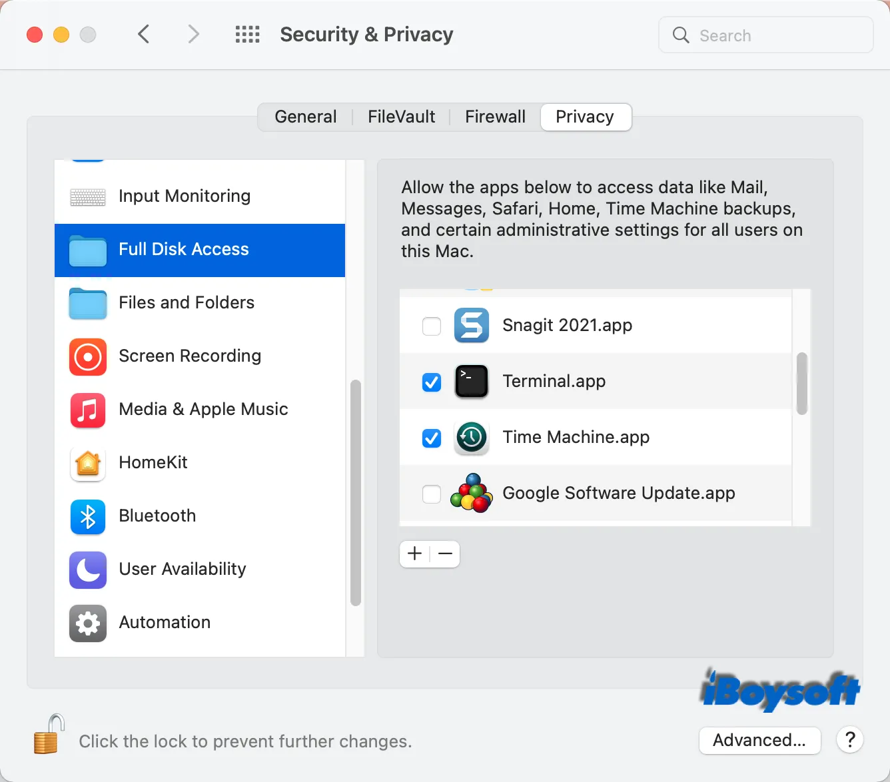
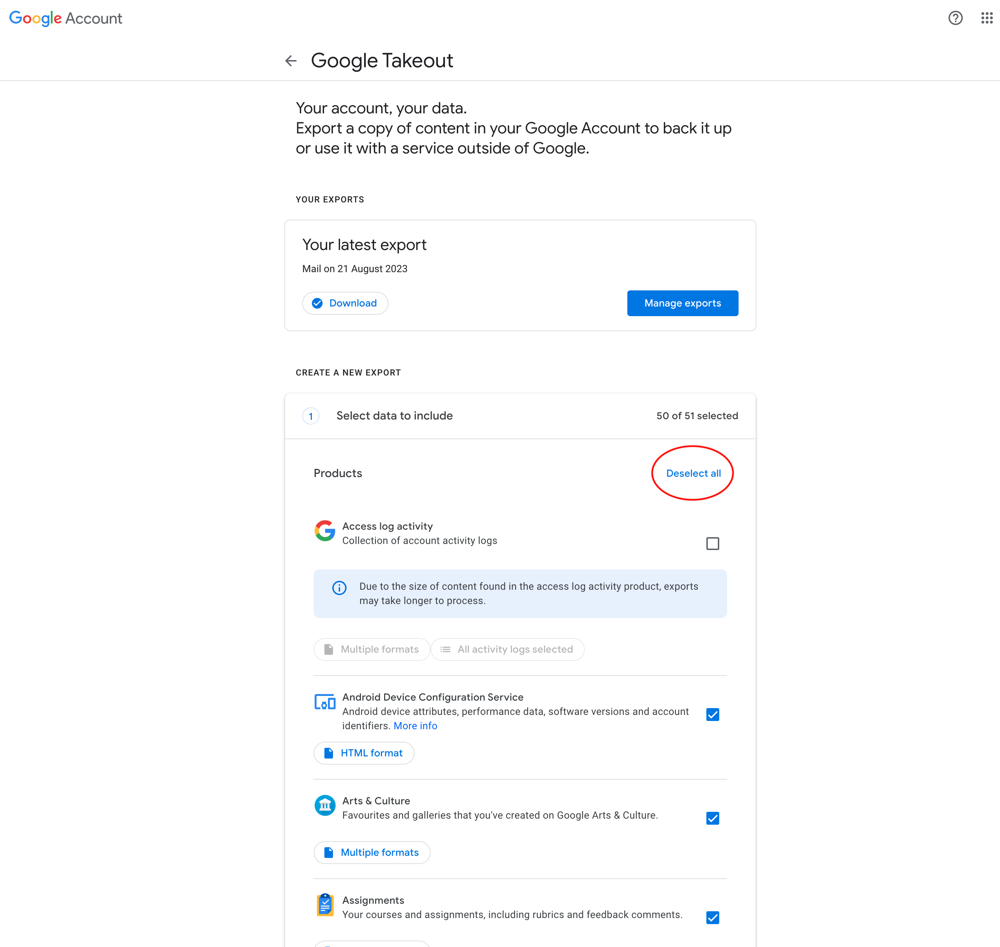
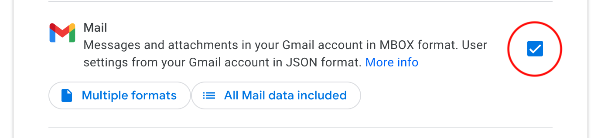
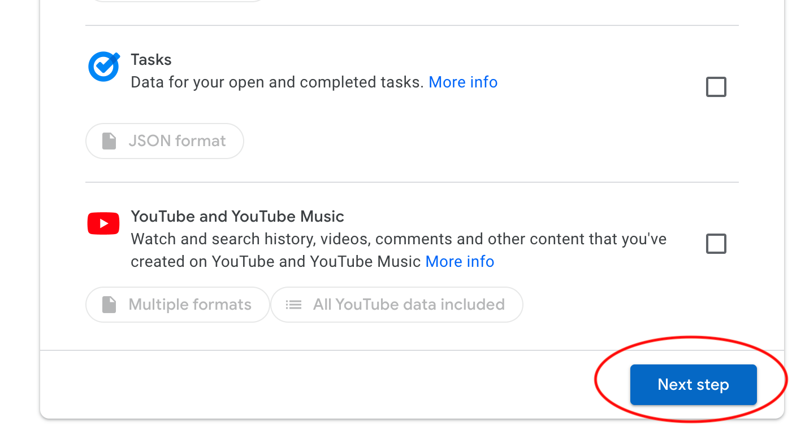
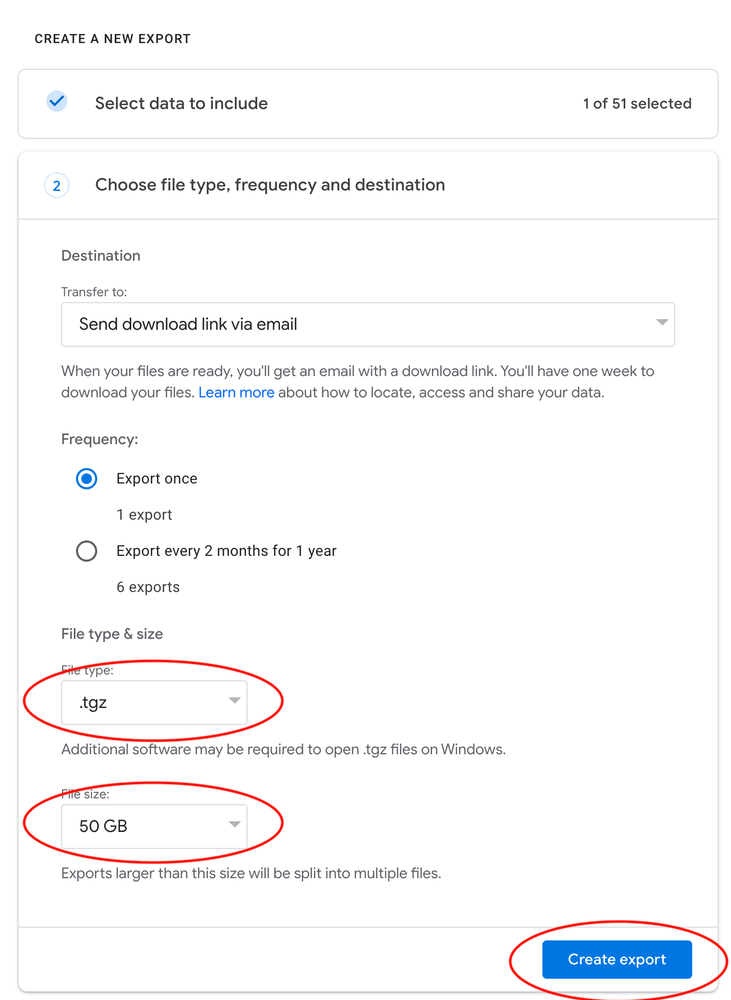
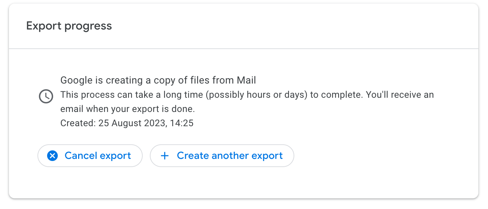
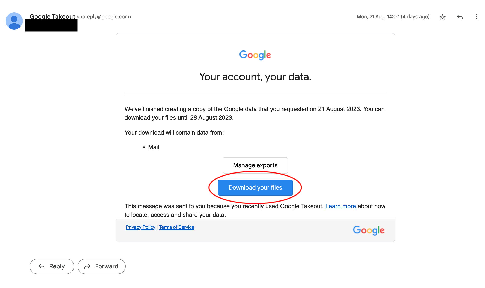

# List of plugins

And how to use them

1. [Apple knowledge](#apple-knowledge)
2. [Apple imessage](#apple-imessage)
3. [Apple photos](#apple-photos)
4. [Apple Safari browsing history](#apple-safari)
5. [Google Chrome browsing history](#google-chrome)
6. [Google Chrome password manager](#google-chrome-password-manager)
7. [Gmail](#gmail)
8. [Google activity](#google-activity)
9. [Telegram](#telegram)

## Apple knowledge
If you are using an Apple device such as Macbook or a Mac Studio, 
with MacOS as your operating system, it's highly likely that you have
a `knowledgeC.db` database file in `/Users/<username>/Library/Application Support/Knowledge/` folder. This database has data about your actions on your device
specifically which applications where used and for how long. 
This command needs to be run locally on Apple device or `knowledgeC.db` file should be placed in the `exports/` directory.

To export data from this database use following command from the repo root directory:

`
python mydata/parsers/apple_knowledge.py
`

If you encounter an error with reading the `knowledgeC.db` file from Terminal, you can try [giving it full disk access](https://iboysoft.com/howto/operation-not-permitted-mac-terminal.html).  

When successful, you will see `cache/apple_knowledgeC.ttl` file created.

You can read more about it here.
- http://www.mac4n6.com/blog/2018/8/5/knowledge-is-power-using-the-knowledgecdb-database-on-macos-and-ios-to-determine-precise-user-and-application-usage
- https://github.com/mac4n6/APOLLO/

## Apple imessage

## Apple photos

## Apple Safari

On your MacOS device Safari browsing history is stored in `/Users/<username>/Library/Safari/History.db` file.
If `History.db` is inaccessible for some reason, you can rename it and put it into exports directory like this `exports/Safari_History.db`.

Run this command to parse it 
`
python mydata/parsers/browser.py
`

When parsing is completed `cache/web_events.nt` file will be created. 

## Google Chrome

Same script that is used in [previous instruction](#apple-safari) is used for parsing Google Chrome browsing history. 
If you have multiple profiles in Google Chrome, all of them will be parsed from corresponding paths
`/Users/<username>/Library/Application Support/Google/Chrome/<Profile>/History`. If this folder is inaccessible 
copy `History` files to `epxorts/` folder and rename them `Chrome_History*.db`

## Google Chrome password manager

## Gmail

1. Go to [Google takeout page](https://takeout.google.com/settings/takeout?pli=1)
2. Deselect all services

3. Select gmail 

4. Go to next page

5. If you have a large number of emails and attachments in your gmail, it's easier to select `.tgz` File type and 50GB limit of file size.  

6. You will see this page, indicating that export started.

7. Go to your gmail and wait for an email from Google Takeout service and download your backup.

Decompress downloaded `takeout-<date>.zip` or `takeout-<date>.tgz` file. 

Find `All mail Including Spam and Trash.mbox` folder in uncompressed files and move it to `exports/` directory. 

Run command from repository root directory: 
`
python mydata/parsers/mbox/mbox_to_rdf.py
`

It might take a while and during the processing there might be error messages but the errors will not stop the processing.
When successful `cache/mbox.nt` file will be generated.

## Google activity

## Telegram